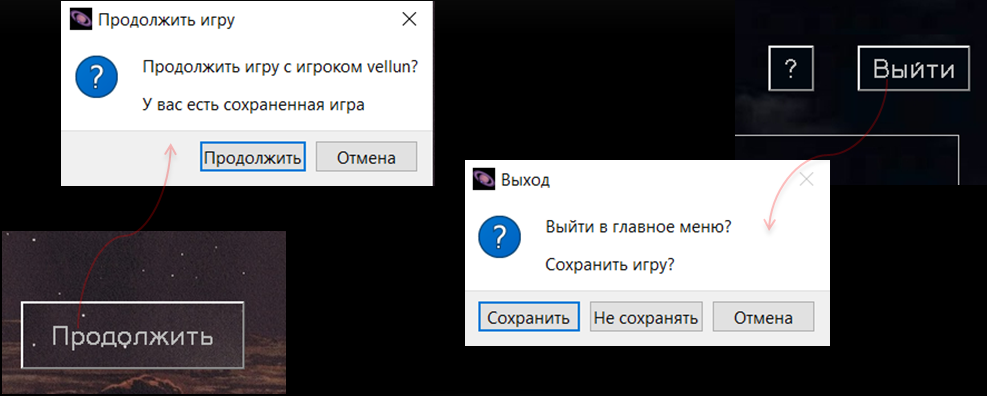
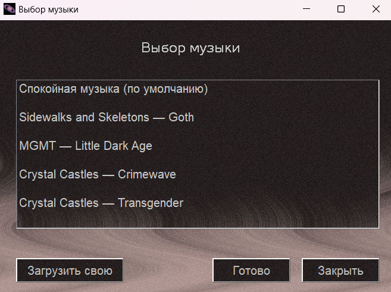
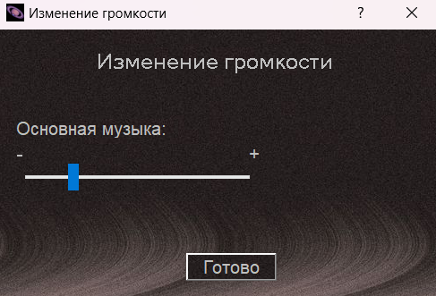
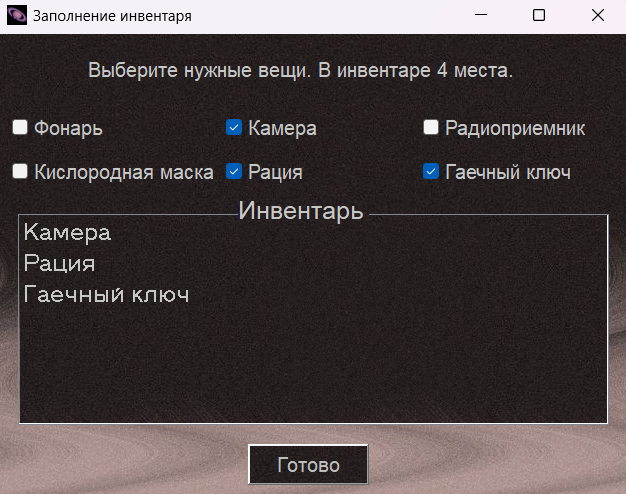
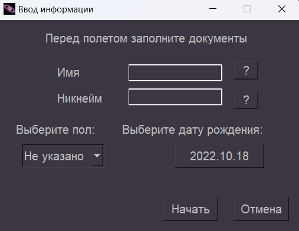
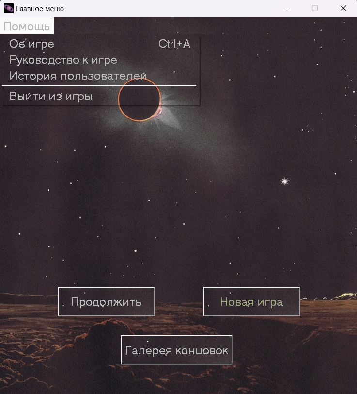

## The Space Travel — текстовый квест с сюжетом и музыкальным сопровождением, выполненный с помощью библиотеки PyQt5 языка python

#### Действия пользователя (выбор вариантов развития сюжета) приводят к одной из нескольких концовок.

  
Описание проекта

  ### Возможности игры
  1. 
 
      
Cохранение и продолжение игры

      ---

      

      

  2. 
 
      
Выбор музыки и изменение громкости

      ---

      
      

      

  3. 
 
      
Инвентарь

      ---

      

      

  3. 
 
      
Сохранение пользователя в историю

      ---

      

      

  
Запустить локально

  ### Раздел в разработке (да не надо вам это запускать)

 ---

